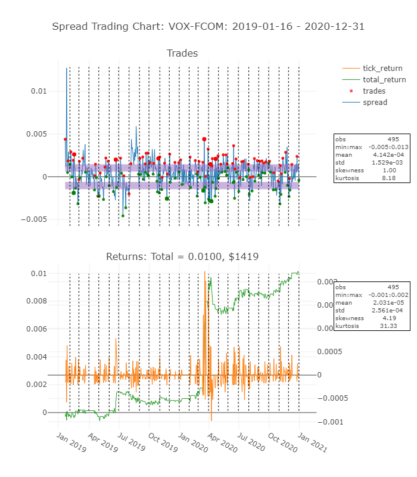

# FINM33150 - Spread Trading Simulation

<!-- START doctoc generated TOC please keep comment here to allow auto update -->
<!-- END doctoc generated TOC please keep comment here to allow auto update -->

## Dependencies

Create a virtual environment and install dependencies with

    pipenv install

## Overview
This assignment required developing a spread trading strategy involving two ETF securities. Below is a summary chart of an executed strategy.

